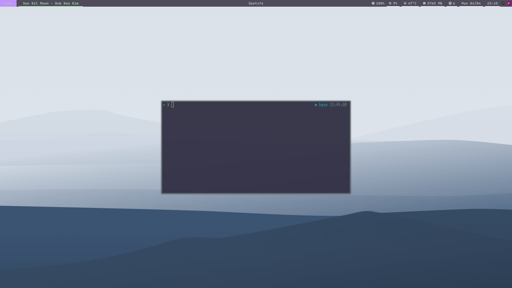

## Overview

This dotfiles repository contains a complete system configuration for a personalized, fast, and minimal Linux experience. It includes window manager settings, terminal utilities, shell enhancements, and custom scripts designed for maximum productivity and aesthetic appeal.



## Built For

<CardGroup cols={2}>
  <Card title="Tiling Window Management" icon="window-restore">
    Powerful i3 window manager configuration with custom layouts and keybindings
  </Card>
  <Card title="Terminal-Based Workflow" icon="terminal">
    Optimized shell environment with zsh, custom utilities, and productivity tools
  </Card>
  <Card title="Developer Productivity" icon="code">
    Preconfigured development tools including Doom Emacs, Neovim, and Git
  </Card>
  <Card title="Lightweight UI" icon="feather">
    Minimal resource usage with aesthetic themes and smooth compositor effects
  </Card>
</CardGroup>

## Key Features

### Custom Command-Line Utilities

All custom binaries are located in `~/dotfiles/bin` and symlinked to `~/.local/bin` for easy access:

| Command  | Description |
|----------|-------------|
| `update` | Updates packages (yay, doom, zinit, etc.) |
| `status` | Prints system summary (use `status -h` for help) |
| `stot`   | Stow wrapper for easier dotfile management |
| `color`  | Terminal color test utility |
| `pass`   | Generates a 42-character secure password |
| `PATH`   | Displays `$PATH` in a readable format |
| `radio`  | Streams internet radio using `mpv` |

### Configured Applications

All configuration files are organized in `.config/`:

- **i3** — Tiling window manager with custom layouts
- **picom** — Compositor for transparency and effects
- **polybar** — Modern status bar
- **rofi** — Application launcher and calculator
- **dunst** — Notification daemon
- **flameshot** — Screenshot tool
- **kitty** — GPU-accelerated terminal emulator
- **doom emacs** — Enhanced Emacs configuration
- **neovim** — Minimalist code editor
- **ranger** — Terminal file manager
- **zathura** — Lightweight document viewer
- **firefox** — Web browser with custom user.js
- **zsh** — Interactive shell with plugins

### Zsh Plugin Stack

Configured in `.config/zsh/plugins.zsh`:

- **powerlevel10k** — Fast and customizable prompt
- **zsh-autosuggestions** — Fish-like autosuggestions
- **zsh-syntax-highlighting** — Command syntax highlighting
- **zsh-history-substring-search** — History search enhancement
- **zsh-completions** — Additional completion definitions
- **fzf** — Fuzzy finder integration
- **yarn-completion** — Yarn command completion
- **direnv** — Directory-based environment management
- **docker/compose** — Docker completions
- **forgit** — Interactive git commands
- **oh-my-zsh plugins**: `sudo`, `fzf`, `bgnotify`

## Repository Structure

<Info>
The dotfiles use a custom `stot` wrapper around GNU Stow for managing symlinks between the repository and system locations.
</Info>

| Directory | Symlink Target | Purpose |
|----------|----------------|----------|
| `.config/` | `~/.config/` | Application configurations |
| `bin/` | `~/.local/bin/` | Custom command-line utilities |
| `home/` | `~/` | Home directory overrides |
| `boot/` | `/boot/` | Bootloader resources |
| `etc/` | `/etc/` | System configuration |
| `srv/` | `/srv/` | Service data |
| `usr/` | `/usr/` | System-wide binaries |

## Startup Routine

The system initializes with the following startup script:

```bash
#!/bin/sh
xrandr --auto
nitrogen --restore &
flameshot &
nvidia-settings --load-config-only &
xmodmap $XDG_DOTFILES_DIR/.config/keyboard/.Xmodmap_dead_greek
```

## Additional Resources

<CardGroup cols={2}>
  <Card title="Wallpapers" icon="image" href="https://gitlab.com/joaopedroaa/wallpapers">
    Custom wallpaper collection
  </Card>
  <Card title="Packages" icon="box" href="https://github.com/joaopedroaa/packages">
    Complete package list for system setup
  </Card>
  <Card title="rEFInd Theme" icon="boot">
    Custom boot manager theme
  </Card>
</CardGroup>

## Next Steps

<Card title="Get Started" icon="rocket" href="/installation">
  Follow the installation guide to set up these dotfiles on your system
</Card>